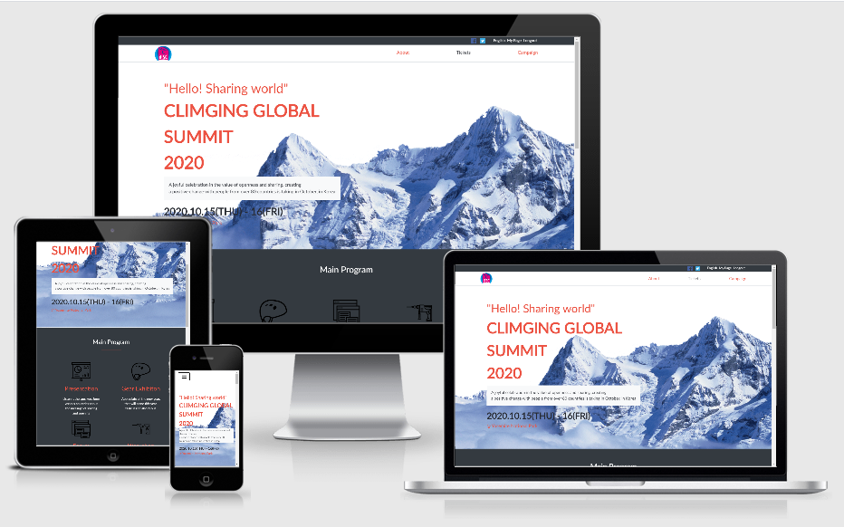

# Climbing Global Summit 2020

## Built With

- HTML, CSS and Bootstrap

## Live Demo

[Live Demo](https://raw.githack.com/pastorp3/HTML-CSS-Capstone-Project/develop/main.html)
Website created to advertise an event , conferences about the I.A
original design idea by [Cindy Shin in Behance](https://www.behance.net/adagio07)

## Getting Started

To get a local copy up and running follow these simple example steps.

git clone https://github.com/pastorp3/HTML-CSS-Capstone-Project
Open the index.html with your favorite browser
Explore our site

### Usage

- Just open the `index.html` file

## Authors

👤 **José Pedraza**

- Github: [@pastorp3](https://github.com/pastorp3)
- Twitter: [@jose_pastorp3](https://twitter.com/jose_pastorp3)
- Linkedin: [linkedin](https://www.linkedin.com/in/jos%C3%A9-pedraza-acevedo-ab700a1a9/)

## 🤝 Contributing

Contributions, issues and feature requests are welcome!

Feel free to check the [issues page](https://github.com/pastorp3/HTML-CSS-Capstone-Project/issues).

## Show your support

Give a ⭐️ if you like this project!

## Acknowledgments

- Hat tip to anyone whose code was used
- Inspiration
- etc

## 📝 License

This project is [MIT](lic.url) licen
